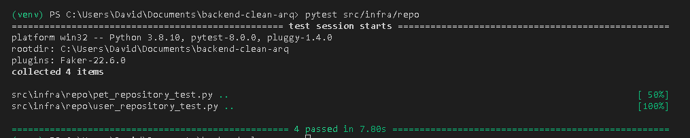
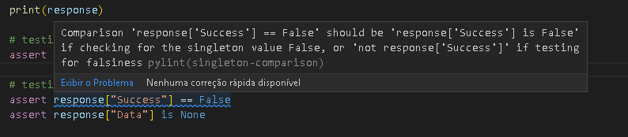

# Sobre:

Uma API de estudo para o CRUD de dados de Usuários e seus Pets.

**Arquitetura:** Clean Architecture

**Framework:** Flask

**Padrão de Json (não aplicado 100%):** JSON:API

**Tecnologias:**

- Python
- pytest (efetuar testes)
- black (formatador)
- flake8 (apontar problemas com a pep8)
- pylint (apontar problemas com a pep8)
- pre-commit (executar as 4 ferramentas anteriores antes de cada commit)
- Sqlite
- Sqlalchemy
- git e github
- jwt (autentificação)
- werkzeug (converter senhas em hash)
- flask_caching (Armazenamento em cache)

Este é um projeto backend que estou desenvolvi a partir da playlist de Clean Architecture com Python do canal Programador Lhama.


## Sobre a Arquitetura

Eu codei esse projeto para aprender **Clean Architecture**.

Aprendi que esse tipo de arquitetura possui alguns benefícios:

- Testabilidade: Eu posso testar partes da aplicação separadamente, como repositories, use cases e controllers. Isso facilita para encontrar erros e garantir que cada uma das partes funciona.

- Flexibilidade e Adaptabilidade: Um sistema feito pela Clean Architecture, não está preso a um banco de dados, uma API, ou um framework específico.

## Rotas

### *api/users*

**GET:**

*api/users/*

SUCESSO:
```
{
  "data": [
    {
      "attributes": {
        "user_name": "Marcos Pietro"
      },
      "id": 1,
      "type": "user"
    },
    {
      "attributes": {
        "user_name": "Antônio Carlos"
      },
      "id": 2,
      "type": "user"
    }
  ]
}
```


*api/users/<int:user_id>*

SUCESSO:
```
{
  "data": [
    {
      "attributes": {
        "user_name": "Marcos Pietro"
      },
      "id": 1,
      "type": "user"
    }
  ]
}
```

**POST:**

Corpo da Requisição:
```
{
    "user_name": "Marcos",
    "password": "marcos123"
}
```

SUCESSO:
```
{
  "data": {
    "Type": "users",
    "attributes": {
      "user_name": "Marcos"
    },
    "id": 1
  }
}
```

**PUT:**

*api/users/<int:user_id>*

Corpo da Requisição:
```
{   

    "user_name": "Marcos Pietro",
    "password": "marcos123"
}
```

SUCESSO:
```
{
  "Success":  True
  "Message": "User updated succesfully"
}
```

**DELETE:**

*api/users/<int:user_id>*

SUCESSO:
```
{
  "Success": True,
  "Message": "User deleted successfully
}
```

### *api/pets*

**GET:**

*api/pets/*

SUCESSO:
```
{
  "data": [
    {
      "attributes": {
        "age": 5,
        "pet_name": "Duque II"
      },
      "id": 1,
      "relationships": {
        "user_id": 1
      },
      "type": "pet"
    },
    {
      "attributes": {
        "age": 3,
        "pet_name": "Mel"
      },
      "id": 2,
      "relationships": {
        "user_id": 1
      },
      "type": "pet"
    }
  ]
}
```

*api/pets/<int:pet_id>*

SUCESSO:
```
{
  "data": [
    {
      "attributes": {
        "age": 5,
        "pet_name": "Duque II"
      },
      "id": 1,
      "relationships": {
        "user_id": 1
      },
      "type": "pet"
    },
  ]
}
```

**POST:**

Corpo da Requisição:
```
{
    "pet_name": "Duque",
    "specie": "DOG",
    "age":5,
    "user_information": {
        "user_id": 1
    }
}
```

SUCESSO:
```
{
  "data": {
    "Type": "pets",
    "attributes": {
      "age": 5,
      "pet_name": "Duque",
      "specie": "DOG"
    },
    "id": 1,
    "relationships": {
      "owner": {
        "id": 1,
        "type": "users"
      }
    }
  }
}
```

**PUT:**

*api/pets/<int:pet_id>*

Corpo da Requisição:
```
{
    "pet_name": "Duque II",
    "specie": "DOG",
    "age":5,
    "user_information": {
        "user_id": 1
    }
}
```

SUCESSO:
```
{
  "Success": True,
  "Message": "Pet updated sucessfully"
}
```

**DELETE:**

*api/pets/<int:pet_id>*

SUCESSO:
```
{
  "Success": True,
  "Message": "Pet deleted sucessfully"
}
```

## Testes

A ferramenta que uso para testar os componentes do projeto é o **pytest**

*Testando so repositórios:*
```
pytest src/infra/repo
```


## Outras ferramentas

Também estou utilizando o repositório **black** para formatar os meus códigos e o repositório **flake8** para me apontar algumas. Ambos visam alinhar o código de acordo com a pep8

Para aplicar os duas ferramentas anteriores eu utilizo o **pre-commit**, que realiza algumas tarefinhas antes de cada commit, como verificar se os requisitos do black, flake8 e pytest foram atendidos, e adicionar as dependências no requirements.txt

Além disso também estou utilizando o **pylint** que me passa algumas dicas de acordo com a pep8.

